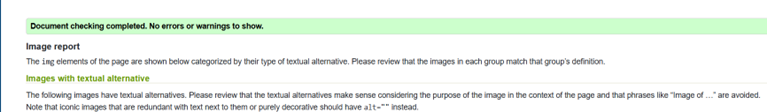
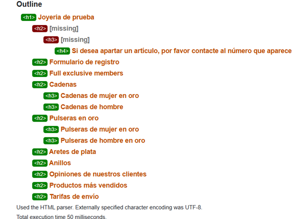
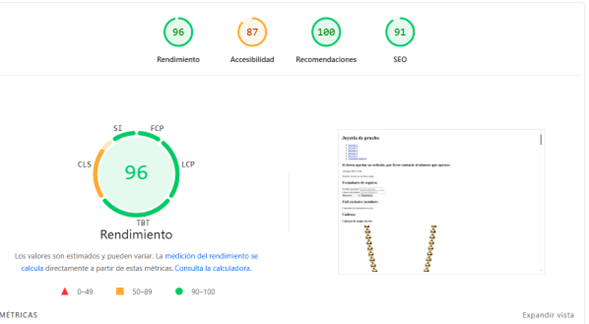

# 💍 La Joshería

## ✨ Descripción
**La Joshería** es el lugar donde encontrarás joyas preciosas y únicas, hechas para resaltar tu belleza y estilo.  
💎 Nuestro catálogo se actualiza constantemente para que siempre descubras algo nuevo.  
🤝 Creemos en la transparencia: compartimos los comentarios reales de nuestros clientes y ofrecemos precios y tarifas de envío justos.

---

## 🏗 Estructura semántica del sitio web
| Elemento | Uso |
|----------|-----|
| `<header>` | Encabezado de la página. |
| `<nav>` | Menú de navegación. |
| `<main>` | Contenido principal. |
| `<section>` | Agrupar contenido relacionado. |
| `<h1> ... <h4>` | Jerarquía de títulos. |
| `
` | Párrafos. |
| `` | Imágenes. |
| `<article>` | Contenido independiente. |
| `<figure>` | Contenedor de elementos gráficos. |
| `<figcaption>` | Descripción de la imagen. |
| `<blockquote>` | Citas textuales destacadas. |
| `<cite>` | Fuente de la cita. |
| `<ul>` | Lista desordenada. |
| `<ol>` | Lista ordenada. |
| `<footer>` | Pie de página. |

🔗 **Link del sitio en Netlify:** [Josheria](https://josheria.netlify.app/)

---

## ✅ Validación W3C
**Capturas de problemas detectados:**  
  
  

| Problema detectado | Explicación | Corrección aplicada |
|--------------------|-------------|---------------------|
| **Textos alternativos poco significativos** | Algunos `alt` de las imágenes solo describían de forma genérica el objeto o repetían contenido visible, lo que no aporta valor a lectores de pantalla. | Se modificaron los `alt` para describir de forma más detallada y relevante los objetos, evitando redundancias. |
| **Salto en la jerarquía de títulos** | Los encabezados (`<h1>`, `<h2>`, `<h3>`) no seguían un orden lógico, afectando accesibilidad y SEO. | Se reestructuró la jerarquía de títulos para seguir un flujo coherente. |

---

## 📊 Validación Lighthouse
**Captura:**  
  

### Puntuaciones y plan de mejoras
| Área | Recomendación | Explicación | Ajustes propuestos |
|------|--------------|-------------|--------------------|
| **Accesibilidad** | `<select>` sin `<label>`. | Los lectores de pantalla no pueden identificar la función del menú desplegable sin un `label`. | Se agregó un `<label>` descriptivo a cada `<select>`. |
| **Accesibilidad** | `tabindex` mayor a 0. | Afecta el orden natural de navegación con teclado. | Se ajustó para que solo haya valores entre `-1` y `0`. |
| **Accesibilidad** | Objetivos táctiles pequeños o muy juntos. | Dificulta la interacción en dispositivos táctiles. | Se aumentó tamaño y separación. |
| **Accesibilidad** | Listas con contenido inválido. | Una lista debe tener solo `<li>` o elementos válidos como `<script>` o `<template>`. | *Pendiente de revisión*. |
| **SEO** | Sin metadescripción. | Afecta la vista previa en buscadores. | Se agregó `<meta name="description" content="Descripción breve y relevante del sitio.">` al `<head>`. |

---

## ♿ Accesibilidad aplicada
- **`tabindex`**: Usado únicamente en imágenes y elementos visuales para facilitar la navegación a usuarios con limitaciones.
- **`aria-label`**: Añadido al botón de envío del formulario para que su función sea clara a lectores de pantalla.
- **Textos alternativos (`alt`)**: Descripciones breves pero representativas para las imágenes, evitando redundancias.
- **Enlaces descriptivos**: Cada enlace indica claramente a dónde llevará al usuario, evitando confusión.
