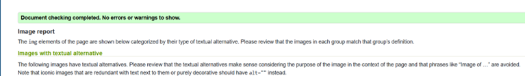
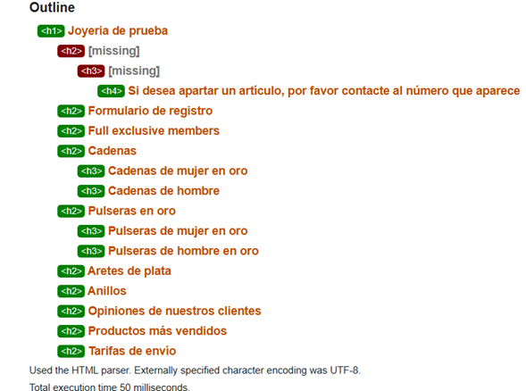
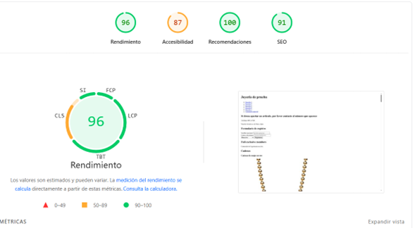

# 💍 La Joshería

## ✨ Descripción
**La Joshería** es el lugar donde encontrarás joyas preciosas y únicas, hechas para resaltar tu belleza y estilo.  
💎 Nuestro catálogo se actualiza constantemente para que siempre descubras algo nuevo.  
🤝 Creemos en la transparencia: compartimos los comentarios reales de nuestros clientes y ofrecemos precios y tarifas de envío justos.

---

## 🏗 Estructura semántica del sitio web
| Elemento | Uso |
|----------|-----|
| `<header>` | Encabezado de la página. |
| `<nav>` | Menú de navegación. |
| `<main>` | Contenido principal. |
| `<section>` | Agrupar contenido relacionado. |
| `<h1> ... <h4>` | Jerarquía de títulos. |
| `
` | Párrafos. |
| `` | Imágenes. |
| `<article>` | Contenido independiente. |
| `<figure>` | Contenedor de elementos gráficos. |
| `<figcaption>` | Descripción de la imagen. |
| `<blockquote>` | Citas textuales destacadas. |
| `<cite>` | Fuente de la cita. |
| `<ul>` | Lista desordenada. |
| `<ol>` | Lista ordenada. |
| `<footer>` | Pie de página. |

🔗 **Link del sitio en Netlify:** [Josheria](https://josheria.netlify.app/)

---

## ✅ Validación W3C
**Capturas de problemas detectados:**  
  
  

| Problema detectado | Explicación | Corrección aplicada |
|--------------------|-------------|---------------------|
| **Textos alternativos poco significativos** | Algunos `alt` de las imágenes solo describían de forma genérica el objeto o repetían contenido visible, lo que no aporta valor a lectores de pantalla. | Se modificaron los `alt` para describir de forma más detallada y relevante los objetos, evitando redundancias. |
| **Salto en la jerarquía de títulos** | Los encabezados (`<h1>`, `<h2>`, `<h3>`) no seguían un orden lógico, afectando accesibilidad y SEO. | Se reestructuró la jerarquía de títulos para seguir un flujo coherente. |

---

## 📊 Validación Lighthouse
**Captura:**  
  

### Puntuaciones y plan de mejoras
| Área | Recomendación | Explicación | Ajustes propuestos |
|------|--------------|-------------|--------------------|
| **Accesibilidad** | `<select>` sin `<label>`. | Los lectores de pantalla no pueden identificar la función del menú desplegable sin un `label`. | Se agregó un `<label>` descriptivo a cada `<select>`. |
| **Accesibilidad** | `tabindex` mayor a 0. | Afecta el orden natural de navegación con teclado. | Se ajustó para que solo haya valores entre `-1` y `0`. |
| **Accesibilidad** | Objetivos táctiles pequeños o muy juntos. | Dificulta la interacción en dispositivos táctiles. | Se aumentó tamaño y separación. |
| **Accesibilidad** | Listas con contenido inválido. | Una lista debe tener solo `<li>` o elementos válidos como `<script>` o `<template>`. | *Pendiente de revisión*. |
| **SEO** | Sin metadescripción. | Afecta la vista previa en buscadores. | Se agregó `<meta name="description" content="Descripción breve y relevante del sitio.">` al `<head>`. |

---

## ♿ Accesibilidad aplicada
- **`tabindex`**: Usado únicamente en imágenes y elementos visuales para facilitar la navegación a usuarios con limitaciones.
- **`aria-label`**: Añadido al botón de envío del formulario para que su función sea clara a lectores de pantalla.
- **Textos alternativos (`alt`)**: Descripciones breves pero representativas para las imágenes, evitando redundancias.
- **Enlaces descriptivos**: Cada enlace indica claramente a dónde llevará al usuario, evitando confusión.

## Selectores de tipo:
 1. **`<header>`**: En este se le aplicaron cambios en letra, color y alineación para el titulo principal de la página web.
 2. **`<nav>`:**  Lo más llamativo es en el apartado de secciones donde se puede observar como todas las secciones quedaron de manera horizontal y alineadas al medio. 
 3. **`<section>`**: Hubieron distintos estilos dependiendo de las secciones, pero me centre más en el apartado de los productos pues en una la combine con `grid `y en otra con `row` para darles un estilo más único, además se combinaron con `cards`
 4. **``**:En las imágenes se manejó de manera más independiente, ya que algunas estaban dentro de `cards` y otras no, por lo tanto, fueron más que todo aumentar o disminuir el tamaño entre ellas. 

## Selectores de clase:
 1. **`.btn`:** En este fue para el único botón que tenía dentro del html al cual se le dieron colores, tamaño, `hover` `border`, entre más estilos. 
 2. **`.card`:** Para este si utilice un estilo relativamente básico pues fue para el apartado de ventas con un fondo blanco, una `position:relative` , un pequeño `padding` y un `border-radius` .
 3. **`.tag`:** En mi caso lo utilice para el nombre del fundador al cual le dimos un `color`, y un `background-color` para hacerle buen contraste. 
 4. **`.badge`:** Este fue utilizado de manera constante para dar avisos sobre los nuevos productos y mostrar el top 5, estos tenían un `color`, `display`, `font-weight`, `border-radius`. 

## Selectores de ID:
 1. **`#Cadenas`:** Esto se utilizó para el apartado de la sección#2 el cual se combinó con `cards`  para darle un estilo más embellecido. 
 2. **`#PulserasOro`:** Esto se utilizó para el apartado de la sección#3 junto a la clase `Row` para darle un estilo más único a los productos de las pulseras. 
 3. **`#AretesPlata`:** Esto se utilizó para el apartado de la sección#4 junto a la clase `Row` para darle un estilo más único a los productos de los aretes de plata.
 4. **`#Anillos:`** Esto se utilizó para el apartado de la sección#5 junto a la clase `Row` para darle un estilo más único a los productos de los anillos. 
 5. **`#OpinionesClientes`:** Esto se utilizó para el apartado de la sección de opiniones de clientes, en las cuales se realizaron `<cite>` y `<blockquote>`a los cuales se les agregaron estilos de para el `font` con `color` y distintos estilos para hacerlo parecer una cita más real. 

## Selectores de atributo:
 1. **`input[type="email"]`:** En este apartado se le cambio el tamaño al `input` para registrarse, además de un `padding` y un `margin-bottom` para el espaciado.
 2. **`img[alt="Ariel el maestro joyero"]`:** Se le agrego al apartado del fundador con un estilo como `padding`, `border` y `border-radius`.
 3.**`a[href="https://www.youtube.com/watch?v=4yAdJv3y_wo..."]`**: A este se le aplico un `font-style:oblique` para que la última sección se vea distinta.

## Combinadores:
 1. **`h2  ~  p`:** Se aplico un cambio de `color: rgb(97, 103, 97)` en los párrafos para los títulos de h2.
 2. **`form  input`:** Se cambio el `border` de los inputs del registro. 
 3. **`blockquote  +  blockquote`:** A los adyacentes le cambiamos el `color`, `margin-top` y `font-style` para que se vean más bonitas las citas. 
 4. **`.table  thead  >  tr  >  th`:** A los hijos directos le cambios la forma para que se vieran como una especia de cuadricula en la parte de los envíos tanto a sus títulos como para las provincias. 

## Pseudo-clases de estado:
 1. **`.btn:hover`:** El `hover` fue aplicado al único botón de registrarse que está en la página.  
 2. **`.card  img:focus-visible`:** El `focus-visible` fue aplicado para aquellas imagenes que aparecen en las secciones de ventas.
 3. **`ul  li  a:active`:** Este fue aplicado para la sección de contenido especial.  

## Pseudo-clases estructurales:
 1. **`nav  li:first-child`:** En la primera sección de la página para cambiarle el tipo de letra. 
 2. **`h2:not(.tituloSecundario)`:** Para cambiarle el titulo a todas las h2 menos a la del registro de formulario. 
 3. **`.table  tbody  tr:last-child`:** En las tarifas de envió a Puntarenas se le bajo un poco más el color de la letra. 

## Especificidad:
 1. **`.container  p`:** Este fue utilizado en la parte del fundador sobre todo en la parte del texto que habla de su historia.

## Box model:
En general el box model fue aplicado a **`cards` , `container`, `input`, `select`, `textarea`, `imagenes`, `imgMvp`, `btn`**, o sea tanto para las secciones de ventas, como en la página general para lo que son sus imágenes, textos de área y los contenedores.

## Overflow 
En un párrafo donde se narra la historia del fundador dentro de **`<section id="Fundador"> `** si a este se le quita el overflow se puede notar el desbordamiento. 

## Flexbox 
 1. En **`nav.container`** Para el cambio de las secciones en donde se querían de manera horizontal. 
 2. En **`Row`** para que las filas de los productos en venta fueran más sencillos de manejar.
 3. **`form  >  div`** Para las secciones de formulario de registro en sus inputs, así se manejaron de manera flexible y con propiedades de columnas. 

## Grid
Se utilizo para la sección de las cadenas con vista en un futuro para hacerlas más dinámicas. 

## Position relative/absolute 
Relative: Estas fueron utilizadas en **`.card`, `btn`, `.quote  blockquote`, `.quote  blockquote  >  *`** estas fueron utilizadas en las cards para mover a los elementos, en el botón de registro y también en las citas de los comentarios de usuario.
 
Absolute:
 3. Este se utilizó en **`.badge`** para que los carteles de nuevo o los tops sean más sencillos de mostrar y aplicar en estilos. 
